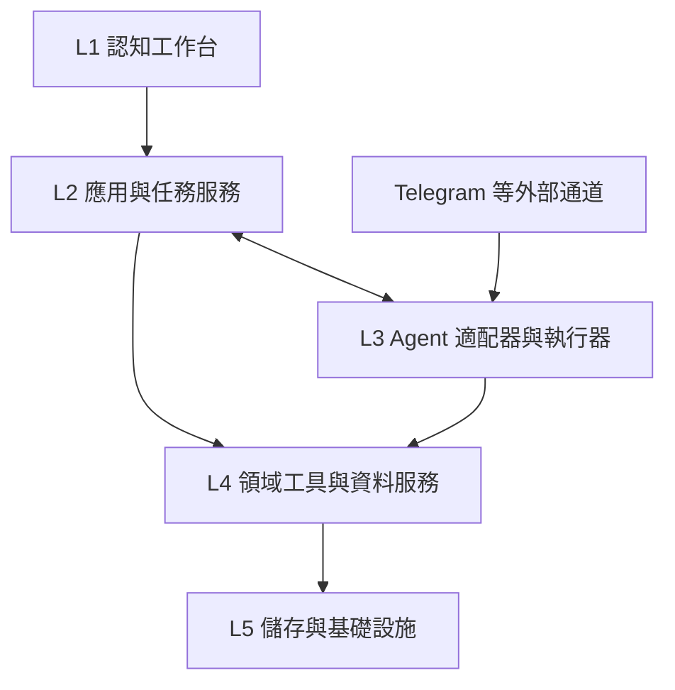

# 認知工作台：五層架構

## 決策與實作狀態

認知工作台是獨立產品。**LifeOS 僅作功能、資料組織與工作流程的參考；新核心重新設計與實作，不把 LifeOS、Pulse 或它的個人目錄當作必要執行環境。** 不完整吸收 LifeOS，先完成[功能取捨地圖](docs/architecture/lifeos-reference.md)，再逐項實作需要的能力。

系統採五層設計，Agent 固定在第三層。Hermes、nanobot 或其他引擎透過適配器接入。這裡的「可替換」指符合工作台契約的實作能接入，不代表把任意程式名稱或 URL 填入現有診斷頁就能運行。

**本文件是重構的目標邊界。** 已有 Electron 原型、覺察／練習介面及 Hermes 診斷接線；新核心與外部輸入到結構化認知資料的管線尚未完成。`core/contracts/processing.ts` 是第一版設計型別，現有 Hermes 適配器尚未實作它，nanobot 尚未接線。現有桌面覺察 API 仍引用歷史 LifeOS integration，這是待替換項，不是新架構的依賴。

## 五層責任

| 層 | 名稱 | 負責什麼 | 不承擔什麼 |
| --- | --- | --- | --- |
| L1 | 認知工作台介面 | 資料閱讀、組織、關聯、修訂、回顧；顯示任務和結果；提交使用者操作 | 模型迴圈、Agent 私有協議、直接寫入資料檔 |
| L2 | 應用與任務服務 | 工作區與用例、任務建立及狀態、選擇 Agent 適配器、取消／恢復策略、使用者確認、向 UI 提供 API 和事件 | 特定模型的推理實作、某個 Agent 的記憶格式 |
| **L3** | **可替換 Agent 資訊處理層** | 理解、摘要、提取、分類、關聯與提出候選；執行工具；封裝引擎的 Gateway、通道與內部路由 | 工作台正式資料的唯一來源、使用者主觀判斷的代填 |
| L4 | 領域工具與資料服務 | 原始輸入、知識、關聯、覺察等領域操作；結構驗證、來源、版本、去重、查詢與結果提交 | 任意引擎的 session 檔案、UI 組件或原生桌面 API |
| L5 | 儲存與基礎設施 | 資料庫／檔案／附件、索引、事件保存、備份、程序與部署的具體實作 | 認知分類規則、模型提示詞、頁面業務流程 |

這是邏輯分層，並非要求部署五個獨立服務。桌面首版可以由少量本機程序組合；程式依賴依靠介面隔離，避免為分層而增加網路呼叫。

手動閱讀、修改、搜尋走 **L1 → L2 → L4 → L5**，不必啟動 Agent。需要資訊處理時，L2 將任務交給 L3，L3 使用 L4 提供的能力。圖中的箭頭表示主要呼叫關係，事件和查詢結果會沿接口回傳。

### 外部輸入的邊界

Telegram Bot 等通道由所選 Agent 系統的 Gateway／路由管理。工作台不重新實作一套 Telegram 接收器。平台驗證、來源和對話識別由通道適配器處理；內容分類、摘要和關聯由 Agent 執行，兩者不是同一種路由。

工作台本身的 HTTP／桌面 API 屬於 L2 的入口適配。更換 L3 不改變工作台 UI 使用的協議。

外部通道橋接在正式處理前，透過 L2 入站接口登記輸入與任務；L2 調用 L4 保存原文，取得工作台管理的 input／task／run ID 與保存回執，再交給 L3 處理。這是適配器要實作的協議，不表示原生 Gateway 已自行支援工作台 ID，也不要求 L3 引入 L2 的程式模組。

## 可替換 Agent 的兩個接口

### 1. 控制接口：L2 → L3

統一任務輸入、能力宣告、健康狀態、運行 ID、事件與錯誤；取消等能力由適配器明確宣告。引擎的專屬 session、approval、RPC 名稱及串流格式在適配器內轉換。不可把「模型 base URL 可換」當成「Agent 執行器可換」。

執行完成、取消請求已接收、真正取消，以及資料保存成功各有明確語義。事件中斷維持結果未知，不自動重送可能產生副作用的任務；不能提供事件重播的適配器需明示限制。

型別入口：[`core/contracts/processing.ts`](core/contracts/processing.ts)。這是設計契約，目前沒有宣稱任何引擎已完成全部能力。

### 2. 資料接口：L3 → L4

Agent 透過工作台工具保存原始輸入、取得背景資料、提交帶證據的候選結果。可使用 MCP、HTTP 或其他可驗證的傳輸；業務契約不隨傳輸改變。

- 原始輸入保留通道、外部訊息識別、原文或附件參照、發生／接收時間。
- 結果帶上 input／task／run ID、引擎資訊、來源參照與不確定項目。
- 去重鍵防止重送變成第二份記錄；版本條件用來發現修訂衝突。
- 資料層確認提交成功後，工作台才顯示已保存。模型說「完成」不是儲存回執。
- 使用者原文、手動修訂與模型候選分開；未知保持未知，模型不得代填主觀量表。

工作台長期資料屬於自己的 L4／L5。Agent 可以保有運行用 session 和記憶，但它們不取代正式認知資料。更換 Agent 時，既有資料、關聯、修訂與來源應保留；必要時向新引擎重新提供上下文。

## nanobot 與 Hermes 的位置

| 候選引擎 | 通道輸入 | 工作台主動派工的可能接口 | 目前在本專案的狀態 |
| --- | --- | --- | --- |
| Hermes | 自己的 Messaging Gateway | 桌面 WebSocket／JSON-RPC 等專用適配 | 已有連接測試；尚未接通通用認知資料接口 |
| nanobot | 自己的 Channels／Gateway | 官方 Python SDK，或 Agent HTTP API 的專用適配 | 已核對官方能力，尚未接線 |
| 其他 Agent | 該引擎自己的通道與路由 | 依共同任務／資料契約提供適配器 | 按需要加入，不預先聲稱相容 |

核對的 nanobot 版本確有 Gateway、Python SDK 和 `nanobot serve` HTTP 接口。但 standalone `serve` 建立自己的 Agent runtime，不等於控制已有的 Telegram Gateway。它的程序內 MessageBus 也不是工作台的持久事件庫。

同理，現在的 `hermes serve --isolated` 診斷接線沒有自動啟動 Hermes Messaging Gateway。能聊天、能接 Bot、能把結果寫進工作台，是需要分別驗證的能力。

Agent 對工作台資料工具的存取，可優先評估 stdio MCP 或經配置的本機接口。具體工具服務及持久化實作尚未完成，不能把現有 `/api/hermes/rpc` 當成工作台通用資料接口。

## 生命週期

若希望關閉工作台視窗後仍能接收 Telegram，Gateway／處理程序及資料接口必須能獨立運行。僅依賴 Electron 主程序內、隨 App 退出的 HTTP 服務不能達到這個目標。這是部署邊界，不需要讓所有模組都變成常駐服務。

目前原型退出 App 時會停止自己啟動的 Hermes `serve` child；背景 Gateway、獨立資料服務及其安裝管理尚未實作。未連接任何 Telegram 帳號，也未安裝背景排程。

## 重構次序

1. 用功能樹與超圖選擇工作台要提供的能力，分清核心資料、可選領域視圖、Agent 本身能力和原框架運維。
2. 為選中的能力定義自己的資料模型、來源、關聯與修訂方式；不直接複製 LifeOS 目錄或 Pulse API。
3. 實作 L4／L5 及 L2 的最小服務，先讓手動操作能獨立完成，再接 L3。
4. 完成一條可驗收管線：通道輸入 → Agent 處理 → 結構化提交 → 工作台可見、可校正、有來源；重送不重複建檔。
5. 以第二個引擎驗證替換：換 Agent 後，不改資料模型與工作台頁面，仍能完成同一條管線。

現有 `/awareness` 與 `/practices` 只是已有可用介面的原型入口，不決定完整工作台的產品邊界。歷史 LifeOS 整合保留為比較與遷移參考，不在尚未選定功能前繼續擴展。

## 參考來源與借鑑邊界

- [DeepTutor 依賴邊界檢查](https://github.com/HKUDS/DeepTutor/blob/f07029cfcf2c8dfccdb671cdfc343db8334f5741/scripts/check_architecture.py)：借鑑 core、application、domain/runtime 和 adapter 的隔離；本專案的五層是根據自身需求制定，不宣稱是它的官方五層。
- [DeepTutor 應用服務](https://github.com/HKUDS/DeepTutor/blob/f07029cfcf2c8dfccdb671cdfc343db8334f5741/deeptutor/app/service.py)：借鑑任務生命週期與執行器分開管理。
- [DeepTutor 外部子 Agent 邊界](https://github.com/HKUDS/DeepTutor/blob/f07029cfcf2c8dfccdb671cdfc343db8334f5741/deeptutor/services/subagent/base.py)：借鑑適配器模式；不將其子 Agent 接入等同主引擎可任意替換。
- [nanobot 架構](https://github.com/HKUDS/nanobot/blob/42f06ab1dcf7329f6bdcce9256fea74a99d19cbb/docs/architecture.md)、[SDK](https://github.com/HKUDS/nanobot/blob/42f06ab1dcf7329f6bdcce9256fea74a99d19cbb/docs/python-sdk.md)、[HTTP API](https://github.com/HKUDS/nanobot/blob/42f06ab1dcf7329f6bdcce9256fea74a99d19cbb/docs/openai-api.md)：核對現有通道及接入能力。
- [Hermes Messaging Gateway](https://hermes-agent.nousresearch.com/docs/user-guide/messaging/)：通道與背景服務的官方邊界。
- [LifeOS v7.40.4 功能參考](https://github.com/danielmiessler/LifeOS/blob/be9e8ef889f00a29f4fd677dee4772fdf32e07ce/LifeOS/install/LIFEOS/DOCUMENTATION/CoreComponents.md)：按需吸收理念並重新實作，不作新核心依賴。
