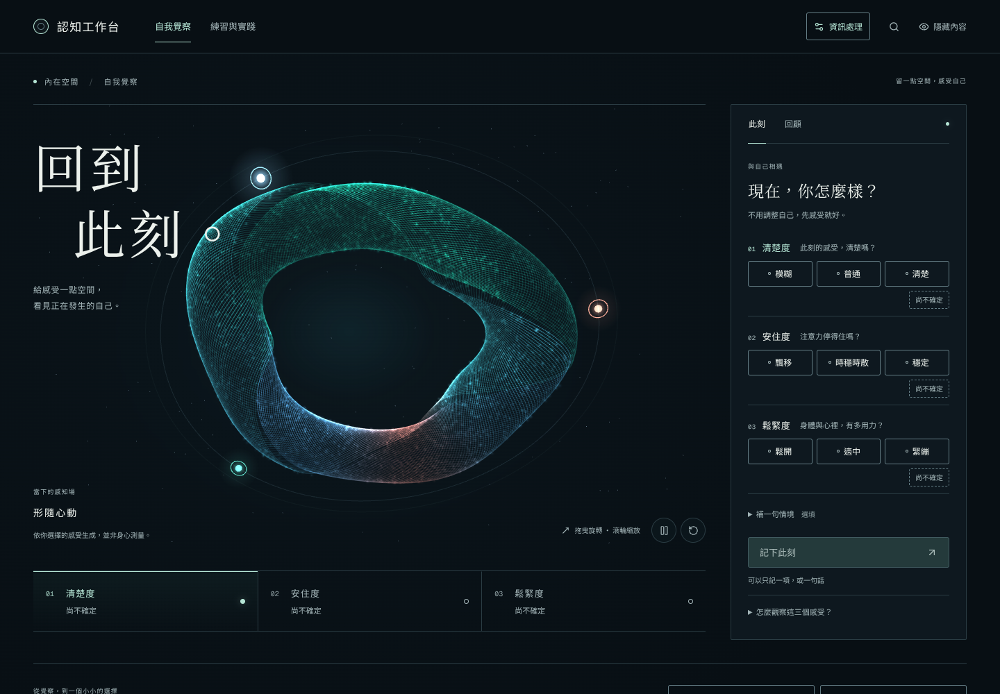

# 認知工作台桌面原型

將既有 Next.js 介面放進 Electron，保持認知工作台作為產品主體。**Agent 是資訊處理層，Telegram Bot 等輸入端屬於 Agent 系統的 Gateway／路由。** 工作台負責資料的保存、組織、呈現與校正，處理層負責依任務整理資訊。

目前開啟 App 會進入既有自我覺察頁，主導覽保留自我覺察與練習；Hermes 的連接與測試放在次要的「資訊處理」入口。這些功能不需要先安裝完整 LifeOS。重構目標見 [五層架構](../ARCHITECTURE.md)：LifeOS 僅作參考，第三層可接 Hermes、nanobot 或其他符合契約的適配器。原型尚未完成獨立核心及 nanobot 接線，詳見 [原型邊界](ARCHITECTURE.md)。

**此版連接本機已安裝、已完成模型設定的 Hermes。安裝包尚未包含 Hermes、Python 或模型。** 這是可編譯、可審查的第一版接入實作，尚待真實 Hermes 與 macOS 安裝包驗收。

**外部輸入路由與處理結果寫入工作台的通用接口尚未完成。** 現有 `/agent` 頁只供處理層連接、診斷和測試對話，不代表 Telegram 已接通工作台。

## 介面預覽



截圖使用暫存工作目錄；未知的覺察狀態維持未知。資訊處理層可以從右上角的次要入口開啟。

## 啟動

開發與編譯需要 Node.js、npm、Bun；僅測試資訊處理層時，需要本機已安裝支援 `hermes serve` 的 Hermes。此分支在 Node.js 24、Bun 1.4.2 上編譯驗證。

在倉庫根目錄安裝桌面及前端依賴：

```sh
npm ci
cd frontend
bun install --frozen-lockfile
cd ..
npm run desktop:build
npm run desktop:start
```

首次開啟 App：

1. App 開啟後可先使用覺察及練習。要測試資訊處理層時，依照 [Hermes 官方安裝與模型設定說明](https://hermes-agent.nousresearch.com/docs/getting-started/quickstart) 完成安裝，先確認它在終端可以正常使用。
2. 從右上角「資訊處理」或原生選單「設定 → 資訊處理層」進入連接頁，在「連接設定」填入 Hermes 可執行檔的完整路徑；留空會搜尋 PATH 和常見安裝位置。這裡接受程式路徑，不接受整段 shell 命令。
3. 按「開始連接」。App 啟動自己的本機 Hermes 服務，等待真正的連線就緒，再開放傳送訊息。
4. 建立測試對話，或選擇 Hermes 已保存的對話接續。模型與供應商設定沿用 Hermes，不需要把 API key 複製進工作台。此操作只驗證處理層連接，不會自動建立工作台的認知資料。

macOS 從 Finder 啟動 App 時，PATH 可能與終端不同。若終端可使用 `hermes`，App 卻找不到，請在終端用 `command -v hermes` 取得完整路徑，填入連接設定。

## 現在可以做什麼

- 建立、列出、恢復 Hermes 對話，保留持久會話 ID 與本次執行 ID 的區別。
- 串流顯示回應、工具執行進度、工具輸入及結果。
- 顯示 Hermes 發出的操作確認與補充問題，將使用者的決定回覆給原始請求。工具是否需要確認，仍依 Hermes 的實際設定及工具行為。
- 中斷目前回應、停止或重新連接 Agent。
- 在 App 內保存、編輯及刪除手動自我覺察紀錄，沿用現有經測試的資料處理器。
- 閱讀原有練習、經咒及方法目錄，並讓 Agent 從工作目錄讀取同一份目錄資料。

可以先嘗試這些任務：

> 先閱讀 WORKBENCH.md，列出工作目錄中現有的資料。沒有紀錄的地方請直接說明。

> 閱讀最近的覺察紀錄，整理我自己描述過的變化。未知欄位保持未知，先在對話中給我回顧。

> 從 reference/practices.json 找出與注意力有關的方法，保留來源及限制，整理成 notes/attention-options.md。

檔案讀寫由真實 Hermes 工具完成。工作目錄只是預設位置，並非作業系統沙盒；`WORKBENCH.md` 是資料約定，不能取代檔案權限或 Hermes 工具政策。

## 現有原型組件

| 組件 | 實作 | 職責 |
| --- | --- | --- |
| 工作台介面 | 既有 Next.js 靜態輸出、React、Three.js | 覺察、練習與使用者操作 |
| 處理層診斷介面 | 次要入口 `/agent` | 連接設定、測試對話與確認卡片 |
| 桌面容器 | `main.mjs`、Electron | 視窗、原生選單、工作目錄、App 關閉與程序清理 |
| 本機橋接 | `lib/server.mjs` | 同來源 HTTP API、SSE 事件、自我覺察 API、靜態頁面 |
| 程序管理 | `lib/hermes-manager.mjs` | 尋找 Hermes、啟停與重連、會話操作、等待確認 |
| 協議適配 | `lib/hermes-gateway.mjs` | WebSocket、JSON-RPC、握手、心跳與雙向請求 |
| 資訊處理層 | 使用者已安裝的 Hermes | 模型、Agent 迴圈、工具、技能及處理用會話 |

Electron 的渲染程序沒有 Node.js 存取權，開啟 `contextIsolation` 與 Chromium sandbox。介面使用窄範圍的本機 API，沒有把任意 shell 執行或 Electron IPC 直接暴露給頁面。

App 啟動時只準備工作目錄和本機介面。使用者按下「開始連接」後，才直接啟動：

```text
hermes serve --host 127.0.0.1 --port 0 --isolated
```

主程序產生臨時認證 token，傳入 `HERMES_DASHBOARD_SESSION_TOKEN`，並設置 `HERMES_DESKTOP=1` 和 `TERMINAL_CWD`。讀取 stdout 的 `HERMES_BACKEND_READY port=…` 訊號後，連接已認證的 `/api/ws`。執行時不使用 shell 字串拼接。

UI 與本機橋接使用另一個隨機 HttpOnly Cookie。服務僅監聽 `127.0.0.1`，驗證 Host、Origin、Cookie，且不開放跨來源 API。

新建及恢復會話使用 `source: cognitive-workbench`，避免宣稱支援 Hermes 官方桌面版才有的視窗、預覽及其他專用工具。新建對話的預設目錄為工作台 workspace；恢復歷史對話會保留 Hermes 的既有會話狀態及目錄。

此處的 `serve` 與 `/api/ws` 不會自動啟動 Telegram Messaging Gateway。外部通道應由其獨立 Gateway 路由，並透過工作台資料接口保存原始輸入與處理結果；這部分尚未實作。若要在工作台退出後繼續接收輸入，Gateway 和資料服務也需要獨立的生命週期。

## 資料保存

透過 App 選單「檔案 → 開啟工作目錄」查看實際位置。預設在 Electron 的使用者資料目錄內：

```text
workspace/
  WORKBENCH.md                 初次建立的資料說明與寫入約定
  SELF_AWARENESS/entries.json  覺察表單保存的主觀紀錄
  reference/practices.json    隨 App 更新的練習目錄與來源
  notes/                     使用者要求 Agent 保存的產出
```

`reference/practices.json` 每次開啟 App 會依附帶的目錄更新。`WORKBENCH.md` 只在不存在時建立，使用者修改會保留。`notes/` 和覺察紀錄不會在啟動時重設。

App 另保存 `desktop-settings.json`，內容只有 Hermes 執行檔位置。Hermes 使用既有的設定與資料目錄；對話、模型憑證、技能和記憶仍由 Hermes 管理。此版不會自動匯入其他 LifeOS 安裝的私人資料。

## 編譯與封裝

```sh
# 前端靜態輸出及 Electron 主程序
npm run desktop:build

# 在目前平台產生未打包成安裝程式的 App 目錄
npm run desktop:pack

# 在 macOS 產生 Apple Silicon DMG 與 ZIP
npm run desktop:dist:mac
```

主程序輸出在 `desktop/dist/`，封裝輸出在 `desktop/release/`，都不提交到 Git。macOS 目標目前設定為 arm64；簽章、Apple notarization、自動更新、Intel Mac／Windows 的安裝分發，以及 Hermes/Python 一起封裝，仍是後續工作。

## 驗證與邊界

```sh
npm run desktop:test
bun test tests/practices integrations/lifeos/modules/self-awareness.test.ts integrations/lifeos/modules/web-chat.test.ts
```

桌面測試使用真實本機 HTTP server、暫存檔案、注入的子程序與 WebSocket 替身，驗證：

- 握手、亂序 RPC、錯誤、逾時、心跳、斷線及重連不自動重送任務。
- 審批回覆使用外層請求 ID，只接受 Hermes 提供的選項；取消或失效的卡片不能重新授權。
- 啟動去重、停止中啟動、啟動中停止、清理舊程序及隔離舊連線事件。
- API 認證、跨來源拒絕、路徑穿越與 symlink 邊界、SSE 重連及清理。

這些測試沒有使用真實模型或使用者憑證。發布前仍須在目標電腦驗證真實 Hermes：模型回覆、讀取覺察／目錄、經確認的工具操作、補充提問、歷史恢復、App 關閉後工具子程序退出，以及實際安裝包的啟動行為。

本次分支的實際驗證結果：

| 驗證 | 結果 |
| --- | --- |
| 桌面協議、程序管理、HTTP／SSE | 38 項測試通過 |
| 原有練習、覺察與 Web chat | 25 項測試通過 |
| Next.js 靜態輸出及 Electron 主程序 | 完整編譯成功 |
| 瀏覽器操作 | 使用真實本機服務與子程序／WebSocket 測試後端，通過連接、設定、串流、單次確認、補充提問、中斷、歷史恢復、覺察寫入、練習頁、窄視窗與停止流程；沒有 JavaScript 執行錯誤 |
| Linux 未封裝安裝器的 App 目錄 | electron-builder 成功產生 |
| 原生視窗 | 目前驗證環境禁止 Electron 單一實例鎖所需的系統 socket，未完成視窗啟動驗收 |
| 真實 Hermes／模型、macOS 安裝及簽章 | 尚未驗證 |

入口定位校正後，另驗證根路徑進入工作台、主要導覽不包含診斷頁，以及次要資訊處理入口仍可開啟。這次校正不改變上述外部路由與入庫接口的未完成狀態。

原有可選商業字體未隨倉庫提供；入口驗證觀察到三個字體資源回傳 404，介面使用系統字體替代，未補入未授權的字體。瀏覽器截圖在測試環境使用 Noto CJK 字體渲染繁體中文。

## Hermes 協議依據

本次對照 Hermes 原始碼版本 `6590f13a1ba21b18224a0f53ef2ead004b5fa7d6`。使用的是官方桌面版採用的本機服務協議；`@hermes/shared` 是上游倉庫內的 private workspace，沒有當作公開 npm SDK 安裝。上游協議變更時，應更新這層適配器與測試。

- [Hermes Desktop 說明](https://hermes-agent.nousresearch.com/docs/user-guide/desktop)
- [官方 Electron 啟動程式](https://github.com/NousResearch/hermes-agent/blob/6590f13a1ba21b18224a0f53ef2ead004b5fa7d6/apps/desktop/electron/main.ts)
- [會話合約](https://github.com/NousResearch/hermes-agent/blob/6590f13a1ba21b18224a0f53ef2ead004b5fa7d6/tui_gateway/contracts/sessions.py)
- [串流事件](https://github.com/NousResearch/hermes-agent/blob/6590f13a1ba21b18224a0f53ef2ead004b5fa7d6/tui_gateway/contracts/events.py)
- [操作確認與補充提問](https://github.com/NousResearch/hermes-agent/blob/6590f13a1ba21b18224a0f53ef2ead004b5fa7d6/tui_gateway/contracts/server_requests.py)
