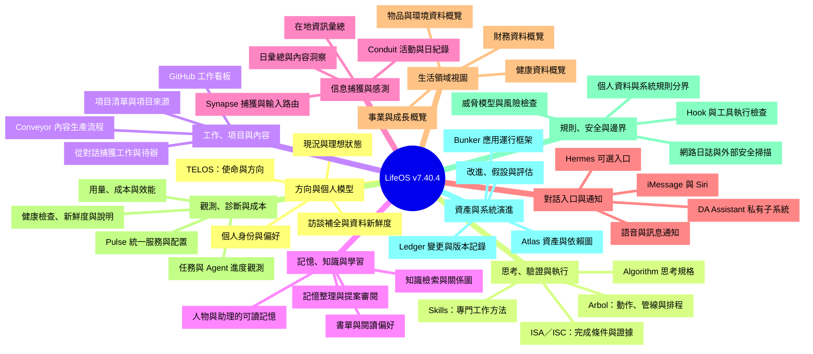

# LifeOS 功能取捨地圖

用途：在認知工作台重構前，先把可借鑑的功能與其關係拆開，不完整吸收 LifeOS。新核心使用自己的領域模型、API、資料與可替換 Agent；五層設計見 [ARCHITECTURE.md](../../ARCHITECTURE.md)。

基線：**LifeOS v7.40.4**，commit `be9e8ef889f00a29f4fd677dee4772fdf32e07ce`，與本專案原有 integration 的來源版本一致。本文件是來源分析，沒有安裝或啟用上游功能。

以下 10 個家族、40 個葉節點和 8 條超邊，是為本次產品取捨建立的分類；不是官方的固定功能總數、資料夾樹或現成超圖資料庫。功能樹列主要歸屬，超圖表達多個功能共同參與的關係。兩者的粒度不同：超圖把同一角色的術語合併為 22 個共用功能節點。

## 1. 功能樹

標記：**程式**表示找到公開實作；**資料規則**表示資料、模板或執行方法；**視圖**表示讀取、整理和呈現既有資料；**外部私有**表示完整能力依賴額外服務或未公開的實作。標成「程式」不表示使用者已配置，標成「視圖」也不表示資料生產流程存在。

### 各功能的實作邊界

下列取捨均是建議，尚非使用者選定的實作範圍。「核心候選」也需要按自有模型重新實作；「取概念」表示縮小後借鑑，不整套移植。

#### 方向與個人模型

| 功能 | 公開形態 | 取捨建議 | 實際邊界 |
| --- | --- | --- | --- |
| 個人身份與偏好 | 資料規則 | 核心候選 | 人物身份、溝通風格、偏好和長期背景主要由 USER 資料與模板表達；資料夾本身不會主動推理。 [來源1](https://github.com/danielmiessler/LifeOS/blob/be9e8ef889f00a29f4fd677dee4772fdf32e07ce/LifeOS/install/LIFEOS/DOCUMENTATION/CoreComponents.md) [來源2](https://github.com/danielmiessler/LifeOS/blob/be9e8ef889f00a29f4fd677dee4772fdf32e07ce/LifeOS/install/USER/PRINCIPAL/PRINCIPAL_IDENTITY.md) |
| TELOS：使命與方向 | 資料規則 | 核心候選 | 整理使命、目標、問題、策略、信念、挑戰，供宿主與工具讀取作背景；不是獨立 Agent。 [來源1](https://github.com/danielmiessler/LifeOS/blob/be9e8ef889f00a29f4fd677dee4772fdf32e07ce/LifeOS/install/LIFEOS/DOCUMENTATION/CoreComponents.md) [來源2](https://github.com/danielmiessler/LifeOS/blob/be9e8ef889f00a29f4fd677dee4772fdf32e07ce/LifeOS/install/USER/TELOS/README.md) |
| 現況與理想狀態 | 資料規則＋視圖 | 取概念 | 以 CURRENT_STATE／IDEAL_STATE 的各領域檔案描述差距；狀態、觀測證據和推測應分开。 [來源1](https://github.com/danielmiessler/LifeOS/blob/be9e8ef889f00a29f4fd677dee4772fdf32e07ce/LifeOS/install/USER/TELOS/CURRENT_STATE/README.md) [來源2](https://github.com/danielmiessler/LifeOS/blob/be9e8ef889f00a29f4fd677dee4772fdf32e07ce/LifeOS/install/USER/TELOS/IDEAL_STATE/README.md) [來源3](https://github.com/danielmiessler/LifeOS/blob/be9e8ef889f00a29f4fd677dee4772fdf32e07ce/LifeOS/install/LIFEOS/PULSE/Observability/observability.ts#L3409) |
| 訪談補全與資料新鮮度 | 程式＋資料規則＋視圖 | 取概念 | 訪談是供 AI 宿主使用的 skill；freshness 工具與 Pulse API 呈現哪些 TELOS 內容需要更新。 [來源1](https://github.com/danielmiessler/LifeOS/blob/be9e8ef889f00a29f4fd677dee4772fdf32e07ce/LifeOS/install/LIFEOS/DOCUMENTATION/CoreComponents.md) [來源2](https://github.com/danielmiessler/LifeOS/blob/be9e8ef889f00a29f4fd677dee4772fdf32e07ce/LifeOS/install/LIFEOS/PULSE/PULSE.toml#L136) |

#### 思考、驗證與執行

| 功能 | 公開形態 | 取捨建議 | 實際邊界 |
| --- | --- | --- | --- |
| Algorithm 思考規格 | 資料規則＋程式 | 交給Agent | 以現況到理想狀態及證據核驗組織任務；是宿主遵循的規格和配套工具，非資料夾自己執行。 [來源1](https://github.com/danielmiessler/LifeOS/blob/be9e8ef889f00a29f4fd677dee4772fdf32e07ce/LifeOS/install/LIFEOS/DOCUMENTATION/CoreComponents.md) [來源2](https://github.com/danielmiessler/LifeOS/blob/be9e8ef889f00a29f4fd677dee4772fdf32e07ce/LifeOS/install/LIFEOS/DOCUMENTATION/ARCHITECTURE_SUMMARY.md) |
| ISA／ISC：完成條件與證據 | 資料規則＋程式 | 取概念 | 在任務開始時說清何謂完成，將條件寫成可核驗項目，並記錄支持完成判斷的證據。 [來源1](https://github.com/danielmiessler/LifeOS/blob/be9e8ef889f00a29f4fd677dee4772fdf32e07ce/LifeOS/install/LIFEOS/DOCUMENTATION/CoreComponents.md) [來源2](https://github.com/danielmiessler/LifeOS/blob/be9e8ef889f00a29f4fd677dee4772fdf32e07ce/LifeOS/install/LIFEOS/DOCUMENTATION/ARCHITECTURE_SUMMARY.md) |
| Skills：專門工作方法 | 資料規則＋程式 | 交給Agent | SKILL.md、工作流程與確定性工具組合成領域能力；依 AI 宿主的技能載入機制使用。 [來源1](https://github.com/danielmiessler/LifeOS/blob/be9e8ef889f00a29f4fd677dee4772fdf32e07ce/LifeOS/install/LIFEOS/DOCUMENTATION/CoreComponents.md) [來源2](https://github.com/danielmiessler/LifeOS/blob/be9e8ef889f00a29f4fd677dee4772fdf32e07ce/LifeOS/install/skills/Research/SKILL.md) |
| Arbol：動作、管線與排程 | 外部私有＋資料規則 | 取概念 | Actions／Pipelines／Flows 提供可組合執行模型；公開版明確沒有 Arbol workers、actions、flows 及本地 runner，僅作架構參考。 [來源1](https://github.com/danielmiessler/LifeOS/blob/be9e8ef889f00a29f4fd677dee4772fdf32e07ce/LifeOS/install/LIFEOS/DOCUMENTATION/Arbol/ArbolSystem.md#L9) [來源2](https://github.com/danielmiessler/LifeOS/blob/be9e8ef889f00a29f4fd677dee4772fdf32e07ce/LifeOS/install/LIFEOS/DOCUMENTATION/Arbol/ArbolSystem.md#L202) |

#### 工作、項目與內容

| 功能 | 公開形態 | 取捨建議 | 實際邊界 |
| --- | --- | --- | --- |
| 從對話捕獲工作與待辦 | 程式 | 取概念 | Algorithm session 同步與 ReminderRouter 將任務、研究、提醒寫入配置好的工作來源；需要宿主 hooks 和實際配置。 [來源1](https://github.com/danielmiessler/LifeOS/blob/be9e8ef889f00a29f4fd677dee4772fdf32e07ce/LifeOS/install/LIFEOS/PULSE/modules/work.ts#L8) [來源2](https://github.com/danielmiessler/LifeOS/blob/be9e8ef889f00a29f4fd677dee4772fdf32e07ce/LifeOS/install/LIFEOS/DOCUMENTATION/CoreComponents.md) |
| GitHub 工作看板 | 程式＋視圖 | 取概念 | Work 模組用 gh 讀取已配置的私有 GitHub Issues，組成看板；未配置時顯示設定提示，離線時返回過期快取。 [來源1](https://github.com/danielmiessler/LifeOS/blob/be9e8ef889f00a29f4fd677dee4772fdf32e07ce/LifeOS/install/LIFEOS/PULSE/modules/work.ts#L8) [來源2](https://github.com/danielmiessler/LifeOS/blob/be9e8ef889f00a29f4fd677dee4772fdf32e07ce/LifeOS/install/LIFEOS/PULSE/PULSE.toml#L108) |
| 項目清單與項目來源 | 資料規則＋視圖 | 延後 | Projects API 讀 PROJECTS.md、TELOS 項目段落與已退役清單；本身没有獨立項目資料庫，也不是項目執行器。 [來源1](https://github.com/danielmiessler/LifeOS/blob/be9e8ef889f00a29f4fd677dee4772fdf32e07ce/LifeOS/install/LIFEOS/PULSE/modules/projects.ts#L1) |
| Conveyor 內容生產流程 | 程式＋視圖 | 延後 | Watcher 與 Runner 寫內容事件台帳；Content 頁顯示階段、請求執行及中止項目，發布保持受控。 [來源1](https://github.com/danielmiessler/LifeOS/blob/be9e8ef889f00a29f4fd677dee4772fdf32e07ce/LifeOS/install/LIFEOS/PULSE/modules/content.ts#L1) [來源2](https://github.com/danielmiessler/LifeOS/blob/be9e8ef889f00a29f4fd677dee4772fdf32e07ce/LifeOS/install/LIFEOS/TOOLS/Conveyor/Ledger.ts) |

#### 記憶、知識與學習

| 功能 | 公開形態 | 取捨建議 | 實際邊界 |
| --- | --- | --- | --- |
| 人物與助理的可讀記憶 | 資料規則＋程式 | 核心候選 | PRINCIPAL_MEMORY 與 DA_MEMORY 作為可閱讀、可檢查的熱記憶；保存的個人知識不應綁定特定 Agent 的私有 session。 [來源1](https://github.com/danielmiessler/LifeOS/blob/be9e8ef889f00a29f4fd677dee4772fdf32e07ce/LifeOS/install/LIFEOS/DOCUMENTATION/CoreComponents.md) [來源2](https://github.com/danielmiessler/LifeOS/blob/be9e8ef889f00a29f4fd677dee4772fdf32e07ce/LifeOS/install/LIFEOS/PULSE/modules/memory.ts#L39) |
| 記憶整理與提案審閱 | 程式＋視圖 | 核心候選 | 公開版有 SessionHarvester、MemoryReviewer／Writer 與學習整理工具；Pulse Memory 頁只觀察狀態、健康與提案，不執行 reviewer 或寫記憶。 [來源1](https://github.com/danielmiessler/LifeOS/blob/be9e8ef889f00a29f4fd677dee4772fdf32e07ce/LifeOS/install/LIFEOS/PULSE/modules/memory.ts#L1) [來源2](https://github.com/danielmiessler/LifeOS/blob/be9e8ef889f00a29f4fd677dee4772fdf32e07ce/LifeOS/install/LIFEOS/PULSE/PULSE.toml#L183) [來源3](https://github.com/danielmiessler/LifeOS/blob/be9e8ef889f00a29f4fd677dee4772fdf32e07ce/LifeOS/install/LIFEOS/DOCUMENTATION/CoreComponents.md) |
| 知識檢索與關係圖 | 程式＋資料規則＋視圖 | 核心候選 | 知識筆記、MemoryRetriever、MemoryGraph 與會話學習資料提供檢索和關係視圖；圖譜展示需要先有可用來源。 [來源1](https://github.com/danielmiessler/LifeOS/blob/be9e8ef889f00a29f4fd677dee4772fdf32e07ce/LifeOS/install/LIFEOS/DOCUMENTATION/CoreComponents.md) [來源2](https://github.com/danielmiessler/LifeOS/blob/be9e8ef889f00a29f4fd677dee4772fdf32e07ce/LifeOS/install/LIFEOS/PULSE/Observability/observability.ts#L1496) [來源3](https://github.com/danielmiessler/LifeOS/blob/be9e8ef889f00a29f4fd677dee4772fdf32e07ce/LifeOS/install/LIFEOS/TOOLS/MemoryRetriever.ts) |
| 書單與閱讀偏好 | 資料規則＋視圖 | 延後 | Books 模組只讀 USER 書單並分組顯示書名、作者、評價與主題；不是完整閱讀器或 AI 導讀引擎。 [來源1](https://github.com/danielmiessler/LifeOS/blob/be9e8ef889f00a29f4fd677dee4772fdf32e07ce/LifeOS/install/LIFEOS/PULSE/modules/books.ts#L1) |

#### 信息捕獲與感測

| 功能 | 公開形態 | 取捨建議 | 實際邊界 |
| --- | --- | --- | --- |
| Synapse 捕獲與輸入路由 | 視圖＋外部私有 | 核心候選 | 捕獲、保留、評估、分流的概念；Pulse API 聚合外部 amber worker、Cloudflare 書籤統計和本機知識，外部完整流程不隨此模組提供。 [來源1](https://github.com/danielmiessler/LifeOS/blob/be9e8ef889f00a29f4fd677dee4772fdf32e07ce/LifeOS/install/LIFEOS/PULSE/modules/synapse.ts#L1) [來源2](https://github.com/danielmiessler/LifeOS/blob/be9e8ef889f00a29f4fd677dee4772fdf32e07ce/LifeOS/install/LIFEOS/DOCUMENTATION/CoreComponents.md) |
| Conduit 活動與日紀錄 | 程式＋視圖 | 延後 | 活動捕獲由獨立 job 執行，Pulse 讀 USER/CONDUIT 的日紀錄；不能把打開儀表板等同啟動感測。 [來源1](https://github.com/danielmiessler/LifeOS/blob/be9e8ef889f00a29f4fd677dee4772fdf32e07ce/LifeOS/install/LIFEOS/PULSE/modules/conduit.ts#L1) [來源2](https://github.com/danielmiessler/LifeOS/blob/be9e8ef889f00a29f4fd677dee4772fdf32e07ce/LifeOS/install/LIFEOS/DOCUMENTATION/Conduit/ConduitSystem.md) |
| 日彙總與內容洞察 | 程式＋視圖 | 延後 | Conduit 依已捕獲事件生成日紀錄，顯示快取洞察，並提供手動觸發洞察生成；需要可用資料與推理服務。 [來源1](https://github.com/danielmiessler/LifeOS/blob/be9e8ef889f00a29f4fd677dee4772fdf32e07ce/LifeOS/install/LIFEOS/PULSE/modules/conduit.ts#L1) [來源2](https://github.com/danielmiessler/LifeOS/blob/be9e8ef889f00a29f4fd677dee4772fdf32e07ce/LifeOS/install/LIFEOS/PULSE/modules/conduit.ts#L55) |
| 在地資訊彙總 | 程式＋視圖 | 延後 | Pulse Local Intelligence 頁讀取已生成的摘要；資料更新由專門 skill/tool 完成，需要配置所在地與來源。 [來源1](https://github.com/danielmiessler/LifeOS/blob/be9e8ef889f00a29f4fd677dee4772fdf32e07ce/LifeOS/install/LIFEOS/PULSE/PULSE.toml#L130) [來源2](https://github.com/danielmiessler/LifeOS/blob/be9e8ef889f00a29f4fd677dee4772fdf32e07ce/LifeOS/install/skills/LocalIntelligence/SKILL.md) |

#### 對話入口與通知

| 功能 | 公開形態 | 取捨建議 | 實際邊界 |
| --- | --- | --- | --- |
| Hermes 可選入口 | 程式＋資料規則 | 交給Agent | Sidecar 提供另一個對話入口，目標是共享身份、記憶和規則；需安裝、配置相應 runtime，非核心工作台必需。 [來源1](https://github.com/danielmiessler/LifeOS/blob/be9e8ef889f00a29f4fd677dee4772fdf32e07ce/LifeOS/install/LIFEOS/DOCUMENTATION/CoreComponents.md) [來源2](https://github.com/danielmiessler/LifeOS/blob/be9e8ef889f00a29f4fd677dee4772fdf32e07ce/LifeOS/install/LIFEOS/DOCUMENTATION/Hermes/HermesSidecar.md) |
| iMessage 與 Siri | 程式 | 延後 | Pulse 具對應入口模組；iMessage 預設關閉，Siri 與消息入口需各自的本機環境、憑證及宿主。 [來源1](https://github.com/danielmiessler/LifeOS/blob/be9e8ef889f00a29f4fd677dee4772fdf32e07ce/LifeOS/install/LIFEOS/PULSE/pulse.ts#L1) [來源2](https://github.com/danielmiessler/LifeOS/blob/be9e8ef889f00a29f4fd677dee4772fdf32e07ce/LifeOS/install/LIFEOS/PULSE/PULSE.toml#L55) |
| 語音與訊息通知 | 程式 | 延後 | Pulse 配置語音及 ntfy 等通知路由；實際通知依服務憑證與個人配置，並非僅有設定項就已可用。 [來源1](https://github.com/danielmiessler/LifeOS/blob/be9e8ef889f00a29f4fd677dee4772fdf32e07ce/LifeOS/install/LIFEOS/PULSE/PULSE.toml#L64) [來源2](https://github.com/danielmiessler/LifeOS/blob/be9e8ef889f00a29f4fd677dee4772fdf32e07ce/LifeOS/install/LIFEOS/DOCUMENTATION/ARCHITECTURE_SUMMARY.md) |
| DA Assistant 私有子系統 | 資料規則＋視圖＋外部私有 | 延後 | Assistant heartbeat、tasks、diary、growth 腳本從公開版移除；配置中預設停用。顯示頁面及身份模板不能當作完整公開實作。 [來源1](https://github.com/danielmiessler/LifeOS/blob/be9e8ef889f00a29f4fd677dee4772fdf32e07ce/LifeOS/install/LIFEOS/PULSE/PULSE.toml#L214) [來源2](https://github.com/danielmiessler/LifeOS/blob/be9e8ef889f00a29f4fd677dee4772fdf32e07ce/LifeOS/install/LIFEOS/PULSE/pulse.ts) |

#### 生活領域視圖

| 功能 | 公開形態 | 取捨建議 | 實際邊界 |
| --- | --- | --- | --- |
| 健康資料概覽 | 資料規則＋視圖 | 延後 | 讀 USER/HEALTH 的狀況、用藥、運動、營養、指標等檔案並呈現；不是醫療或穿戴裝置自動接入。 [來源1](https://github.com/danielmiessler/LifeOS/blob/be9e8ef889f00a29f4fd677dee4772fdf32e07ce/LifeOS/install/LIFEOS/PULSE/Observability/observability.ts#L2473) [來源2](https://github.com/danielmiessler/LifeOS/blob/be9e8ef889f00a29f4fd677dee4772fdf32e07ce/LifeOS/install/USER/HEALTH/README.md) |
| 財務資料概覽 | 資料規則＋視圖 | 延後 | 整理收入、支出、帳戶、投資、稅務及 vendor／obligation YAML；没有因頁面存在而自動連接銀行。 [來源1](https://github.com/danielmiessler/LifeOS/blob/be9e8ef889f00a29f4fd677dee4772fdf32e07ce/LifeOS/install/LIFEOS/PULSE/Observability/observability.ts#L2550) [來源2](https://github.com/danielmiessler/LifeOS/blob/be9e8ef889f00a29f4fd677dee4772fdf32e07ce/LifeOS/install/USER/FINANCES/README.md) |
| 事業與成長概覽 | 資料規則＋視圖＋外部私有 | 延後 | 事業視圖讀 USER 工作／公司資料；Growth 是可選的個人客製工具，不是每個公開安裝都有的完整營運數據管線。 [來源1](https://github.com/danielmiessler/LifeOS/blob/be9e8ef889f00a29f4fd677dee4772fdf32e07ce/LifeOS/install/LIFEOS/PULSE/Observability/observability.ts#L46) [來源2](https://github.com/danielmiessler/LifeOS/blob/be9e8ef889f00a29f4fd677dee4772fdf32e07ce/LifeOS/install/LIFEOS/PULSE/Observability/observability.ts#L2907) |
| 物品與環境資料概覽 | 資料規則＋視圖 | 延後 | 展示物品、資產與已有環境／空氣資料；硬件感測器及個人輪詢 job 需要另外配置，不應預設收集。 [來源1](https://github.com/danielmiessler/LifeOS/blob/be9e8ef889f00a29f4fd677dee4772fdf32e07ce/LifeOS/install/LIFEOS/PULSE/lib/modules.ts#L21) [來源2](https://github.com/danielmiessler/LifeOS/blob/be9e8ef889f00a29f4fd677dee4772fdf32e07ce/LifeOS/install/LIFEOS/PULSE/Observability/observability.ts#L4359) [來源3](https://github.com/danielmiessler/LifeOS/blob/be9e8ef889f00a29f4fd677dee4772fdf32e07ce/LifeOS/install/LIFEOS/PULSE/PULSE.toml#L178) |

#### 觀測、診斷與成本

| 功能 | 公開形態 | 取捨建議 | 實際邊界 |
| --- | --- | --- | --- |
| Pulse 統一服務與配置 | 程式 | 取概念 | Bun daemon 提供 HTTP API、靜態工作台、定時任務及模組載入。這是可執行程式，与資料目錄、AI 模型不同。 [來源1](https://github.com/danielmiessler/LifeOS/blob/be9e8ef889f00a29f4fd677dee4772fdf32e07ce/LifeOS/install/LIFEOS/PULSE/pulse.ts#L1) [來源2](https://github.com/danielmiessler/LifeOS/blob/be9e8ef889f00a29f4fd677dee4772fdf32e07ce/LifeOS/install/LIFEOS/PULSE/lib/modules.ts#L21) |
| 任務與 Agent 進度觀測 | 程式＋視圖 | 取概念 | 由工作狀態、工具活動、失敗和子 Agent 事件生成儀表板與 SSE 更新；展示觀測到的執行，不等於面板自身是 Agent 引擎。 [來源1](https://github.com/danielmiessler/LifeOS/blob/be9e8ef889f00a29f4fd677dee4772fdf32e07ce/LifeOS/install/LIFEOS/PULSE/Observability/observability.ts#L760) [來源2](https://github.com/danielmiessler/LifeOS/blob/be9e8ef889f00a29f4fd677dee4772fdf32e07ce/LifeOS/install/LIFEOS/DOCUMENTATION/CoreComponents.md) |
| 用量、成本與效能 | 程式＋視圖 | 延後 | Pulse usage／performance 模組及成本聚合 jobs 顯示推理和運行成本；我們可只採用統一任務事件中的必要用量。 [來源1](https://github.com/danielmiessler/LifeOS/blob/be9e8ef889f00a29f4fd677dee4772fdf32e07ce/LifeOS/install/LIFEOS/PULSE/lib/modules.ts#L21) [來源2](https://github.com/danielmiessler/LifeOS/blob/be9e8ef889f00a29f4fd677dee4772fdf32e07ce/LifeOS/install/LIFEOS/PULSE/PULSE.toml#L160) [來源3](https://github.com/danielmiessler/LifeOS/blob/be9e8ef889f00a29f4fd677dee4772fdf32e07ce/LifeOS/install/LIFEOS/DOCUMENTATION/CoreComponents.md) |
| 健康檢查、新鮮度與說明 | 程式＋視圖 | 取概念 | Doctor、healthcheck、tab freshness、wiki/提示用於排錯與解釋數據；這些是服務診斷，不是用戶認知功能本身。 [來源1](https://github.com/danielmiessler/LifeOS/blob/be9e8ef889f00a29f4fd677dee4772fdf32e07ce/LifeOS/install/LIFEOS/PULSE/lib/modules.ts#L4) [來源2](https://github.com/danielmiessler/LifeOS/blob/be9e8ef889f00a29f4fd677dee4772fdf32e07ce/LifeOS/install/LIFEOS/PULSE/PULSE.toml#L168) [來源3](https://github.com/danielmiessler/LifeOS/blob/be9e8ef889f00a29f4fd677dee4772fdf32e07ce/LifeOS/install/LIFEOS/DOCUMENTATION/CoreComponents.md) |

#### 規則、安全與邊界

| 功能 | 公開形態 | 取捨建議 | 實際邊界 |
| --- | --- | --- | --- |
| 個人資料與系統規則分界 | 資料規則 | 核心候選 | 分離可發布系統程式、個人配置與私人內容，建立資料分類和存取邊界；可取原則後自行實現。 [來源1](https://github.com/danielmiessler/LifeOS/blob/be9e8ef889f00a29f4fd677dee4772fdf32e07ce/LifeOS/install/LIFEOS/DOCUMENTATION/CoreComponents.md) [來源2](https://github.com/danielmiessler/LifeOS/blob/be9e8ef889f00a29f4fd677dee4772fdf32e07ce/LifeOS/install/LIFEOS/DOCUMENTATION/SystemUserBoundary.md) [來源3](https://github.com/danielmiessler/LifeOS/blob/be9e8ef889f00a29f4fd677dee4772fdf32e07ce/LifeOS/install/LIFEOS/DOCUMENTATION/Security/DataClassification.md) |
| Hook 與工具執行檢查 | 程式＋資料規則 | 取概念 | 在 session／工具生命週期的固定事件運行確定性檢查和上下文注入；應由工具與應用邊界落實，不只寫在提示詞內。 [來源1](https://github.com/danielmiessler/LifeOS/blob/be9e8ef889f00a29f4fd677dee4772fdf32e07ce/LifeOS/install/LIFEOS/DOCUMENTATION/CoreComponents.md) [來源2](https://github.com/danielmiessler/LifeOS/blob/be9e8ef889f00a29f4fd677dee4772fdf32e07ce/LifeOS/install/LIFEOS/PULSE/modules/hooks.ts) [來源3](https://github.com/danielmiessler/LifeOS/blob/be9e8ef889f00a29f4fd677dee4772fdf32e07ce/LifeOS/install/LIFEOS/DOCUMENTATION/ARCHITECTURE_SUMMARY.md) |
| 威脅模型與風險檢查 | 資料規則＋程式＋視圖 | 延後 | 提供 ThreatModel 相關方法、工具與 Pulse 視圖；與一般任務授權應區分，不需把全部資安研究功能加入認知工作台。 [來源1](https://github.com/danielmiessler/LifeOS/blob/be9e8ef889f00a29f4fd677dee4772fdf32e07ce/LifeOS/install/LIFEOS/PULSE/lib/modules.ts#L21) [來源2](https://github.com/danielmiessler/LifeOS/blob/be9e8ef889f00a29f4fd677dee4772fdf32e07ce/LifeOS/install/skills/ThreatModel/SKILL.md) |
| 網路日誌與外部安全掃描 | 程式＋視圖＋外部私有 | 延後 | Syslog listener 是公開但預設關閉且需設備配置；Arbol／Bunker 的部署面掃描為私有外部基礎設施，兩者不能混為已啟用服務。 [來源1](https://github.com/danielmiessler/LifeOS/blob/be9e8ef889f00a29f4fd677dee4772fdf32e07ce/LifeOS/install/LIFEOS/PULSE/PULSE.toml#L120) [來源2](https://github.com/danielmiessler/LifeOS/blob/be9e8ef889f00a29f4fd677dee4772fdf32e07ce/LifeOS/install/LIFEOS/DOCUMENTATION/Arbol/ArbolSystem.md#L9) [來源3](https://github.com/danielmiessler/LifeOS/blob/be9e8ef889f00a29f4fd677dee4772fdf32e07ce/LifeOS/install/LIFEOS/DOCUMENTATION/Bunker/BunkerSystem.md#L47) |

#### 資產與系統演進

| 功能 | 公開形態 | 取捨建議 | 實際邊界 |
| --- | --- | --- | --- |
| Atlas 資產與依賴圖 | 程式＋視圖 | 取概念 | 公開 CLI 與 collectors 彙整 GitHub、Cloudflare、項目、物品與系統服務，查擁有關係／影響範圍，輸出 Pulse 快照；屬衍生證據。 [來源1](https://github.com/danielmiessler/LifeOS/blob/be9e8ef889f00a29f4fd677dee4772fdf32e07ce/LifeOS/install/LIFEOS/ATLAS/Atlas.ts#L3) [來源2](https://github.com/danielmiessler/LifeOS/blob/be9e8ef889f00a29f4fd677dee4772fdf32e07ce/LifeOS/install/LIFEOS/PULSE/modules/atlas.ts#L1) |
| Ledger 變更與版本記錄 | 程式＋視圖 | 取概念 | 記錄版本、改動、完整性與部署事件；可精簡為我們自己的變更來源、任務結果及內容版本，不必吸收整個部署系統。 [來源1](https://github.com/danielmiessler/LifeOS/blob/be9e8ef889f00a29f4fd677dee4772fdf32e07ce/LifeOS/install/LIFEOS/DOCUMENTATION/CoreComponents.md) [來源2](https://github.com/danielmiessler/LifeOS/blob/be9e8ef889f00a29f4fd677dee4772fdf32e07ce/LifeOS/install/LIFEOS/DOCUMENTATION/ARCHITECTURE_SUMMARY.md) [來源3](https://github.com/danielmiessler/LifeOS/blob/be9e8ef889f00a29f4fd677dee4772fdf32e07ce/LifeOS/install/LIFEOS/TOOLS/LedgerDeployEvent.ts) |
| 改進、假設與評估 | 程式＋視圖 | 取概念 | Upgrades 彙整改進記錄與待處理假設，提供接受／拒絕；配合 Evals 評估。接受提案不等於自動修改所有系統代碼。 [來源1](https://github.com/danielmiessler/LifeOS/blob/be9e8ef889f00a29f4fd677dee4772fdf32e07ce/LifeOS/install/LIFEOS/PULSE/modules/upgrades.ts#L8) [來源2](https://github.com/danielmiessler/LifeOS/blob/be9e8ef889f00a29f4fd677dee4772fdf32e07ce/LifeOS/install/LIFEOS/PULSE/lib/modules.ts#L21) [來源3](https://github.com/danielmiessler/LifeOS/blob/be9e8ef889f00a29f4fd677dee4772fdf32e07ce/LifeOS/install/LIFEOS/DOCUMENTATION/CoreComponents.md) |
| Bunker 應用運行框架 | 資料規則＋視圖＋外部私有 | 延後 | 描述資料備份、部署回滾、健康、身份與安全等通用應用需求；公開版只有概念及面板接入，reference implementation 和 CLI 私有。 [來源1](https://github.com/danielmiessler/LifeOS/blob/be9e8ef889f00a29f4fd677dee4772fdf32e07ce/LifeOS/install/LIFEOS/DOCUMENTATION/Bunker/BunkerSystem.md#L14) [來源2](https://github.com/danielmiessler/LifeOS/blob/be9e8ef889f00a29f4fd677dee4772fdf32e07ce/LifeOS/install/LIFEOS/DOCUMENTATION/CoreComponents.md) |

### 工作台自有內容

手動自我覺察、練習與實踐內容、原有簡單文字對話入口是本專案的新增／客製功能，不列入 LifeOS 上游功能樹。對話入口的存在也不決定新產品必須以聊天為首頁。

## 2. 功能關係超圖

令 `H = (V, E)`：`V` 是功能，`E` 是功能集合。一條超邊可以同時關聯 3 個以上功能。下列每條有 4–6 個成員，共 43 個成員關係。採用「功能節點—超邊節點」的關聯表示即可完整呈現它；不要把集合內所有功能兩兩連線後，誤稱每一對都有直接依賴。

| 超邊 | 共同參與的功能 | 證據與可用程度 |
| --- | --- | --- |
| [H1 意圖對齊](#h1) | 人生方向與目標、目前狀態、理想狀態、完成定義與驗證條件、證據與結果驗證 | 已核實 |
| [H2 任務執行與跨次延續](#h2) | 專案、完成定義與驗證條件、任務推進機制、工具與代理執行、決策與學習紀錄、檢索與脈絡恢復 | 已核實 |
| [H3 目標到下一步](#h3) | 人生方向與目標、專案、目標與專案巡查、工作項目與狀態、查看與回顧介面 | 已核實 |
| [H4 記憶整理、修訂與再利用](#h4) | 輸入與捕獲、整理與修訂審閱、記憶與知識、檢索與脈絡恢復、查看與回顧介面 | 已核實 |
| [H5 活動感知與現況回顧](#h5) | 內部活動感知、輸入與捕獲、目前狀態、人生方向與目標、記憶與知識、查看與回顧介面 | 部分實作／需接線 |
| [H6 外部資訊到知識與行動](#h6) | 輸入與捕獲、資訊保存與路由、人生方向與目標、記憶與知識、工作項目與狀態、檢索與脈絡恢復 | 完整實作未公開 |
| [H7 有事件才啟動背景跟進](#h7) | 事件觸發的背景跟進、輸入與捕獲、工具與代理執行、提醒與摘要交付 | 部分實作／需接線 |
| [H8 執行證據與可觀測狀態](#h8) | 執行事件掛鉤、完成定義與驗證條件、工作項目與狀態、工具與代理執行、運行紀錄與診斷、查看與回顧介面 | 已核實 |

### H1：意圖對齊

長期方向與現況共同界定差距，ISA 將本次任務的意圖寫成可驗證條件，結果再對照意圖檢查。

- Intent 在官方文件中是跨功能概念：TELOS 承載長期意圖，ISA 承載任務意圖，memory/context 承載情境，verification 完成回饋。
- 此超邊整理的是共同目的與資訊關係，不宣稱存在名為 Intent 的獨立 runtime service。
- TELOS.md 是 canonical source；PRINCIPAL_TELOS.md 為生成摘要，獨立 MISSION.md、GOALS.md 等是 legacy samples/fallback。

**邊界：** 意圖對齊是設計與資料契約；不代表所有現況資料已自動感知或目標落差已自動計算。

**取捨：** 優先吸收方向、現況、下一步、完成證據之間的資料關係；不需要一併採用原作所有 prompt 與 hooks。

來源：[LifeOS/install/LIFEOS/DOCUMENTATION/LifeOs/LifeOsThesis.md](https://github.com/danielmiessler/LifeOS/blob/be9e8ef889f00a29f4fd677dee4772fdf32e07ce/LifeOS/install/LIFEOS/DOCUMENTATION/LifeOs/LifeOsThesis.md#L30-L44) · [LifeOS/install/LIFEOS/DOCUMENTATION/LifeOs/LifeOsThesis.md](https://github.com/danielmiessler/LifeOS/blob/be9e8ef889f00a29f4fd677dee4772fdf32e07ce/LifeOS/install/LIFEOS/DOCUMENTATION/LifeOs/LifeOsThesis.md#L87-L95) · [LifeOS/install/USER/TELOS/README.md](https://github.com/danielmiessler/LifeOS/blob/be9e8ef889f00a29f4fd677dee4772fdf32e07ce/LifeOS/install/USER/TELOS/README.md#L14-L36)

### H2：任務執行與跨次延續

專案與一次性任務共用 ISA 類型的持久產物；Agent 推進工作、保存決策和學習，後续以產物恢復脈絡。

- Project ISA 存在專案 repo，跨多次任務持續演進；Task ISA 保存於 MEMORY/WORK，描述一次性工作。
- Tools/Agents 進行執行，ISA 保留 claims、證據、決策與學習。Resume 在本圖合併到 retrieval：恢復依據是持久產物，不是專屬 Agent 的聊天記憶。
- 可拆分給新 context 的 ephemeral feature files 是派生視圖，reconcile 回 master ISA；此細節保留為原框架可選機制。

**邊界：** 原生 hooks、逐 ISC checkpoint 和較完整的 ISA 格式是 LifeOS 執行框架機制，不能假設其他 Agent 自動支援。

**取捨：** 吸收專案/任務分離、持久工作狀態、決策理由及恢復能力；控制協議由 Hermes/nanobot 等 adapter 處理。

來源：[LifeOS/install/LIFEOS/DOCUMENTATION/ISA/ISASystem.md](https://github.com/danielmiessler/LifeOS/blob/be9e8ef889f00a29f4fd677dee4772fdf32e07ce/LifeOS/install/LIFEOS/DOCUMENTATION/ISA/ISASystem.md#L230-L246) · [LifeOS/install/LIFEOS/DOCUMENTATION/ISA/ISASystem.md](https://github.com/danielmiessler/LifeOS/blob/be9e8ef889f00a29f4fd677dee4772fdf32e07ce/LifeOS/install/LIFEOS/DOCUMENTATION/ISA/ISASystem.md#L269-L292) · [LifeOS/install/hooks/ISASync.hook.ts](https://github.com/danielmiessler/LifeOS/blob/be9e8ef889f00a29f4fd677dee4772fdf32e07ce/LifeOS/install/hooks/ISASync.hook.ts#L121-L145)

### H3：目標到下一步

把沒有下一步的目標與久未活動的專案變成可檢視的工作項，供看板與回顧使用。

- WorkSweep 讀 PROJECTS.md 並查看 Git 最後提交時間，建立去重的 Project-Check issue。
- WorkSweep 從 PRINCIPAL_TELOS.md 的 Active Goals 讀 G-ID，沒有匹配 open issue 時建立 Goal issue。
- 此邊把 issue、工作狀態與看板合併為 work/pulse 的功能關係；GitHub Issues 與 MEMORY/STATE/work.json 仍是不同實體，不應混用其 ID。

**邊界：** 完整 Work System 的 SessionEnd capture hook 與 TASKLIST regenerator 涉及私有元件；不能由這段公開 code 推定整條原工作追蹤鏈開箱即用。

**取捨：** 吸收『有目標卻無下一步』與『專案需要重新確認』；任務可存工作台自己的 store，無需綁 GitHub 或 commit 年齡。

來源：[LifeOS/install/LIFEOS/TOOLS/WorkSweep.ts](https://github.com/danielmiessler/LifeOS/blob/be9e8ef889f00a29f4fd677dee4772fdf32e07ce/LifeOS/install/LIFEOS/TOOLS/WorkSweep.ts#L337-L486) · [LifeOS/install/LIFEOS/DOCUMENTATION/Work/WorkSystem.md](https://github.com/danielmiessler/LifeOS/blob/be9e8ef889f00a29f4fd677dee4772fdf32e07ce/LifeOS/install/LIFEOS/DOCUMENTATION/Work/WorkSystem.md#L12-L14) · [LifeOS/install/LIFEOS/TOOLS/WorkSweep.ts](https://github.com/danielmiessler/LifeOS/blob/be9e8ef889f00a29f4fd677dee4772fdf32e07ce/LifeOS/install/LIFEOS/TOOLS/WorkSweep.ts#L620-L633)

### H4：記憶整理、修訂與再利用

從會話等輸入整理出 typed memory，對需要確認的修訂作出決定，再把相關記憶帶入新的任務。

- memory、idea、knowledge、proposal 是不同資料類型；type 決定路由，tier 決定寫入規則，兩者不應混成一個分類。
- MemoryReviewer 讀近期 transcript、產生 typed items，交由 MemorySystem.add 處理。Proposal Decisions 與閱覽介面在本圖合併 review/pulse。
- 檢索包括 hot-layer 及 BM25 relevant context；不代表所有歷史訊息永遠塞進每次 prompt。
- 原作有自動套用與人工決定兩種情形，本圖不暗示所有寫入都由人工批准，亦不把該自動套用策略推薦為工作台預設。

**邊界：** 宿主 transcript 採集、hook cadence、模型與自動套用政策需要適配；不是換一個 Agent 就會自動繼承。

**取捨：** 优先吸收來源、候選/已整理資料、修訂決策、相關檢索；Cortex 的 agent-neutral CLI 可列作局部復用候選。

來源：[LifeOS/install/LIFEOS/DOCUMENTATION/Memory/MemorySystem.md](https://github.com/danielmiessler/LifeOS/blob/be9e8ef889f00a29f4fd677dee4772fdf32e07ce/LifeOS/install/LIFEOS/DOCUMENTATION/Memory/MemorySystem.md#L99-L145) · [LifeOS/install/LIFEOS/DOCUMENTATION/Memory/MemorySystem.md](https://github.com/danielmiessler/LifeOS/blob/be9e8ef889f00a29f4fd677dee4772fdf32e07ce/LifeOS/install/LIFEOS/DOCUMENTATION/Memory/MemorySystem.md#L147-L172) · [LifeOS/install/LIFEOS/DOCUMENTATION/Memory/MemorySystem.md](https://github.com/danielmiessler/LifeOS/blob/be9e8ef889f00a29f4fd677dee4772fdf32e07ce/LifeOS/install/LIFEOS/DOCUMENTATION/Memory/MemorySystem.md#L64-L78)

### H5：活動感知與現況回顧

內部活動形成每日紀錄並供回顧；把活動進一步對應人生目標是設計關係，這版尚有未完成部分。

- 已 shipped 的部分是 appFocus/git/claudeSession 捕獲→JSONL→deterministic daily record→Pulse 查看，v1.1 增加 content-type insight。
- 每日紀錄屬 observed current state；Conduit 文件描述它與 Cortex、TELOS gap 的關係。
- 活動→TELOS goal 自動標記在此版仍屬 v2 roadmap，受 D-11 validation spike 限制；不能標成已完整實作的自動對齊分析。
- Conduit 的 daily record 不等於 Synapse 的 amber ledger，兩條捕獲流程在原架構中的持久來源不同。

**邊界：** H5 是混合成熟度超邊。實線僅代表已描述 shipped 的捕獲與展示，通往自動目標評分的部分應以虛線/部分完成標示。

**取捨：** 先吸收手動/可選輸入的現況回顧；是否做 app focus、瀏覽器或帳戶感測器另行決定。

來源：[LifeOS/install/LIFEOS/DOCUMENTATION/Conduit/ConduitSystem.md](https://github.com/danielmiessler/LifeOS/blob/be9e8ef889f00a29f4fd677dee4772fdf32e07ce/LifeOS/install/LIFEOS/DOCUMENTATION/Conduit/ConduitSystem.md#L9-L30) · [LifeOS/install/LIFEOS/DOCUMENTATION/Conduit/ConduitSystem.md](https://github.com/danielmiessler/LifeOS/blob/be9e8ef889f00a29f4fd677dee4772fdf32e07ce/LifeOS/install/LIFEOS/DOCUMENTATION/Conduit/ConduitSystem.md#L42-L98) · [LifeOS/install/LIFEOS/DOCUMENTATION/Conduit/ConduitSystem.md](https://github.com/danielmiessler/LifeOS/blob/be9e8ef889f00a29f4fd677dee4772fdf32e07ce/LifeOS/install/LIFEOS/DOCUMENTATION/Conduit/ConduitSystem.md#L188-L195)

### H6：外部資訊到知識與行動

先保存來源，再按方向整理與路由，形成可回顧的知識或行動；這條完整原 pipeline 不能由公開 release 直接啟動。

- Synapse 的概念順序是 capture→journal→grade→route→resurface；保存發生在模型評估前，低評分输入亦保留。
- 共同捕獲契約包括 source、external_id、captured_at、url/content 與去重規則。
- TELOS 用於評估與路由；目的地可以是 Cortex knowledge、work item/project、reminder 等，檢索/再浮現屬保存契約的一部分。
- Feed 是外部來源的私有實作說明；Synapse 的 capture endpoint 與部分 worker 也為 per-install private infrastructure。公開 Pulse 頁面或讀取端不等於完整 pipeline。

**邊界：** status『現有不可用』僅指無法從 v7.40.4 公開 payload 直接取得完整可運行鏈，不表示維護者私有系統不存在，也不表示公開版沒有相關展示或工具。

**取捨：** 核心概念優先吸收；用 Hermes/nanobot 的既有渠道加上我們自己的 capture/store/tools 契約實作，無需重建原 Arbol/Feed 基建。

來源：[LifeOS/install/LIFEOS/DOCUMENTATION/Synapse/SynapseSystem.md](https://github.com/danielmiessler/LifeOS/blob/be9e8ef889f00a29f4fd677dee4772fdf32e07ce/LifeOS/install/LIFEOS/DOCUMENTATION/Synapse/SynapseSystem.md#L35-L114) · [LifeOS/install/LIFEOS/DOCUMENTATION/Synapse/SynapseSystem.md](https://github.com/danielmiessler/LifeOS/blob/be9e8ef889f00a29f4fd677dee4772fdf32e07ce/LifeOS/install/LIFEOS/DOCUMENTATION/Synapse/SynapseSystem.md#L133-L218) · [LifeOS/install/LIFEOS/DOCUMENTATION/Feed/FeedSystem.md](https://github.com/danielmiessler/LifeOS/blob/be9e8ef889f00a29f4fd677dee4772fdf32e07ce/LifeOS/install/LIFEOS/DOCUMENTATION/Feed/FeedSystem.md#L5-L11)

### H7：有事件才啟動背景跟進

便宜的定期檢查先決定是否有值得處理的事件，再喚醒 Agent；需要提醒或稍後摘要的發現留有紀錄。

- Tick.ts 可檢查 calendar lookahead、important-mail header candidates、到期 queue，以及預設關閉的 location。
- 最後一行 wakeAgent:false/true 是 Hermes scheduler 的 wake-gate 契約；無 findings 時不觸發模型處理。
- Heartbeat ledger 用於 findings 與 quiet-hours/brief，不是 LifeOS Ledger 的版本/變更 authority；因此不把兩者合併成同一節點。
- 腳本存在不代表 cron 已安裝。Calendar private skill、gws mail CLI、個人 config 及通知交付均有額外依賴。

**邊界：** scripts ship; wiring does not。Mount 不安裝這些 cron；缺少 private calendar/gws 等工具會 skip。圖上不能標成已預設啟用的完整主動助理。

**取捨：** 採納 follow-up/reminder 與 wake-gate 概念；把排程、喚醒和交付留在可替換 runtime adapter 的能力範圍。

來源：[LifeOS/install/LIFEOS/HERMES/Heartbeat/Tick.ts](https://github.com/danielmiessler/LifeOS/blob/be9e8ef889f00a29f4fd677dee4772fdf32e07ce/LifeOS/install/LIFEOS/HERMES/Heartbeat/Tick.ts#L1-L18) · [LifeOS/install/LIFEOS/HERMES/Heartbeat/Tick.ts](https://github.com/danielmiessler/LifeOS/blob/be9e8ef889f00a29f4fd677dee4772fdf32e07ce/LifeOS/install/LIFEOS/HERMES/Heartbeat/Tick.ts#L147-L186) · [LifeOS/install/LIFEOS/DOCUMENTATION/Hermes/HermesSidecar.md](https://github.com/danielmiessler/LifeOS/blob/be9e8ef889f00a29f4fd677dee4772fdf32e07ce/LifeOS/install/LIFEOS/DOCUMENTATION/Hermes/HermesSidecar.md#L366-L381)

### H8：執行證據與可觀測狀態

掛鉤同步任務產物狀態並記錄工具/Agent 事件，Pulse 讀取同一批狀態和日誌顯示進度與故障。

- ISASync 把 ISA frontmatter/criteria 同步到 work.json，deriveAscent 從同一資料衍生顯示狀態。
- 工具活動、工具失敗、subagent events 等寫入 JSONL；Pulse 按需讀取尾部並彙整，介面透過 polling 查看。
- Work node 在此指 MEMORY/STATE/work.json 的執行登記，不是把它與 H3 的 GitHub issue 寫成同一份檔案。
- 這是運行/診斷關係；可以為工作台使用者投射少量處理狀態，而不暴露原框架全部 hooks 和 telemetry。

**邊界：** 原 hook event、路徑、Pulse daemon 和狀態欄位與 LifeOS/Claude Code 宿主相關，需要薄適配，不能原封不動當成通用 Agent 事件格式。

**取捨：** 保留收到/處理中/待確認/已入庫/失敗等少量產品狀態；其餘 telemetry 留在診斷與運維。

來源：[LifeOS/install/hooks/ISASync.hook.ts](https://github.com/danielmiessler/LifeOS/blob/be9e8ef889f00a29f4fd677dee4772fdf32e07ce/LifeOS/install/hooks/ISASync.hook.ts#L1-L31) · [LifeOS/install/hooks/ISASync.hook.ts](https://github.com/danielmiessler/LifeOS/blob/be9e8ef889f00a29f4fd677dee4772fdf32e07ce/LifeOS/install/hooks/ISASync.hook.ts#L121-L145) · [LifeOS/install/LIFEOS/DOCUMENTATION/Observability/ObservabilitySystem.md](https://github.com/danielmiessler/LifeOS/blob/be9e8ef889f00a29f4fd677dee4772fdf32e07ce/LifeOS/install/LIFEOS/DOCUMENTATION/Observability/ObservabilitySystem.md#L9-L54)

## 3. 建議先吸收什麼

優先順序先按工作台的認知資料流程決定，而不是按 LifeOS 頁面數量搬運。

| 優先級 | 參考功能 | 新工作台的最小實作 | 暫不一起引入 |
| --- | --- | --- | --- |
| 核心候選 | Synapse 的來源保存 | 原始輸入、附件參照、來源、去重、處理狀態 | Amber／Cloudflare 私有 pipeline、來源自動評分及外部 Feed 基建 |
| 核心候選 | Cortex 的記憶與知識 | 知識項、筆記、引用、關聯、相關脈絡檢索 | 原宿主 hooks、全部 memory tiers、自動覆寫的信心門檻 |
| 核心候選 | 記憶提案與修訂 | 原文／模型候選／人工確認分開，修訂有版本 | 全自動修改身份、規則或程式碼 |
| 簡化借鑑 | TELOS 與 ISA | 可選方向、關注問題及明確完成條件 | 整套人生評分、Algorithm 儀式與宿主生命週期 |
| 簡化借鑑 | Pulse／Observability | 收到、處理中、待確認、已保存、失敗 | 完整 Agent 監控中心、運維儀表板與原生 daemon |
| 可選擴充 | Projects／WorkSweep | 與知識相連的下一步、專案與回顧 | 綁定 GitHub Issues、私有 tasklist 技能 |
| 後續再選 | Conduit／Heartbeat／生活領域頁 | 有明確用途時增加感測、提醒或領域視圖 | 預設背景感測、郵件日曆接入與全部領域管理 |
| 交給 Agent 或自行另建 | Skills、Gateway、Arbol、Bunker | Agent 使用自己的技能與通道；工作台保留工具契約 | 將 LifeOS 的整套 AI／雲端執行／部署框架放進產品核心 |

這些建議不表示立即實作全部候選。先選一條能完整驗收的流程，再用下一個 Agent 驗證資料和介面不需重寫。

## 4. 對應五層架構

| 層 | 來自這張功能圖的產品責任 |
| --- | --- |
| L1 工作台介面 | 閱讀、組織、關係查看、修訂、回顧；自有覺察與練習也在這裡 |
| L2 應用服務 | 輸入與任務登記、使用者操作、處理狀態、確認和事件 |
| L3 Agent | Hermes／nanobot 等處理器的 Gateway、路由、推理、技能與工具調用 |
| L4 領域工具與資料服務 | 捕獲、知識、來源、關聯、檢索、修訂、版本與去重 |
| L5 儲存與基礎設施 | 持久資料、附件、索引、事件記錄與備份 |

**來源資料與正式知識留在工作台，Agent 的 session 只作執行上下文。** 這是「LifeOS 只作參考、Agent 只占第三層」能落實為程式邊界的關鍵。

## 5. 可重用的盤點資料

- [功能樹與逐項來源](lifeos-features.json)：10 家族、40 個功能節點、自有功能另列，包含公開形態及建議。
- [超圖節點、超邊與逐邊來源](lifeos-hypergraph.json)：22 個功能節點、8 條超邊；保留合併前術語、限制與證據。
- [官方核心組件](https://github.com/danielmiessler/LifeOS/blob/be9e8ef889f00a29f4fd677dee4772fdf32e07ce/LifeOS/install/LIFEOS/DOCUMENTATION/CoreComponents.md)。
- [Pulse 模組開關註冊表](https://github.com/danielmiessler/LifeOS/blob/be9e8ef889f00a29f4fd677dee4772fdf32e07ce/LifeOS/install/LIFEOS/PULSE/lib/modules.ts)：30 個開關並不是功能總數，更不表示全部服務都已運行。
